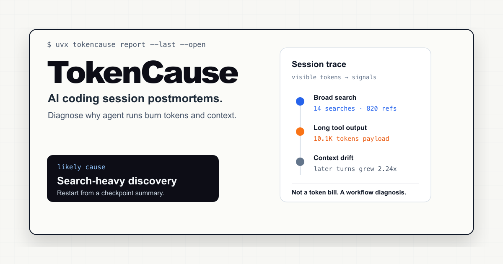

# TokenCause

[](https://github.com/happyaaa/tokencause/actions/workflows/test.yml)

[English](README.md)



本地 AI coding session 复盘工具。

TokenCause 读取本地 Codex 和 Claude Code 会话，解释一次 run 为什么变贵、变吵、或者不可信。

它回答五个问题：

- 这次 session 为什么变贵？
- 哪些文件烧掉了上下文？
- 哪些命令输出了大量噪音？
- 哪里在没有新证据的情况下反复 retry？
- 下一次 session 应该怎么开？

## 快速开始

第一次发布到 PyPI 之后，可以直接用 `uvx` 运行：

```bash
uvx tokencause report --last --open
```

或者安装成长期可用的 CLI：

```bash
uv tool install tokencause
# 或者
pipx install tokencause
```

在第一次 PyPI release 发布前，可以先从 GitHub 安装：

```bash
pipx install git+https://github.com/happyaaa/tokencause
```

然后分析你自己的本地 AI coding sessions：

```bash
tokencause doctor
tokencause report --last --open
tokencause overview --session-reports --open
```

或者 clone repo 跑 demo：

```bash
git clone https://github.com/happyaaa/tokencause.git
cd tokencause
python3 tokencause.py serve --demo
```

`report` 生成单个本地诊断报告。`overview` 生成多 session 总览。两者都会自动优先使用本地 Codex sessions；没有 Codex 时再使用 Claude Code。

## 你会看到什么

报告开头直接给最有用的部分：

- likely cause
- strongest evidence
- attribution quality
- value judgment
- next run plan
- reusable workflow lesson

底层会检测 repeated context、长命令输出、昂贵文件、失败重试、宽泛探索、session drift、弱验证、大 review surface、上下文污染等信号。

## 高级用法

启动本地 server：

```bash
tokencause serve
```

生成静态 dashboard 文件或 JSON：

```bash
tokencause dashboard --session-reports
tokencause dashboard --json
```

分析单独的 TokenCause session trace：

```bash
tokencause analyze examples/tokencause_trace.jsonl --budget 2
tokencause analyze examples/tokencause_trace.jsonl --budget 2 --json
```

生成 demo/static artifacts：

```bash
tokencause dashboard --demo
tokencause demo-site
```

所有 JSON 输出的根对象都会包含 `schema_version` 和 `version`，方便下游工具把数据结构变更和 CLI 版本区分开。输出契约见 [docs/JSON_OUTPUT.md](docs/JSON_OUTPUT.md)。更多 demo 命令见 [docs/DEMO.md](docs/DEMO.md)。

## 当前输入

TokenCause 当前支持：

- Codex Desktop/CLI 本地会话。
- Claude Code 本地 JSONL 会话。
- Claude Code OpenTelemetry JSON/JSONL export。
- 通用 JSONL trace。

`examples/` 里的文件是假数据，只用于快速试跑 CLI。真实使用时应该指向你自己的 agent trace 日志。

## 当前状态

TokenCause 目前是 alpha，但已经可以用于本地诊断。现在最强的路径是 Codex local session analysis，其次是 Claude Code local sessions 和 Claude OpenTelemetry exports。Generic JSONL 是高级集成路径，但诊断深度取决于这些日志里是否包含 workflow metadata。

当前边界见 [docs/LIMITATIONS.md](docs/LIMITATIONS.md)，尤其是 billed/model tokens、observable transcript tokens、cache tokens、estimated waste 之间的区别。

## 隐私

TokenCause 是 local-first 工具。它只读取你传入路径里的本地 session 文件、trace export、可选价格配置文件，或标准 Codex/Claude 本地目录。它不会把对话数据、源码、trace 或报告上传到任何托管服务。

生成的报告和 `.tokencause-cache` 文件可能包含本地路径、命令输出片段和 session metadata。分享报告、缓存或用真实 trace 提 issue 前，请先看 [SECURITY.md](SECURITY.md)。

## Codex 会话

列出最近的本地 Codex 会话：

```bash
tokencause codex scan
tokencause codex scan --json
```

解释最近更新的会话：

```bash
tokencause codex explain --last
tokencause codex explain --last --json
```

解释指定 thread：

```bash
tokencause codex explain --thread-id 019eb90f
```

用你自己填写的 token 单价估算美元成本：

```bash
tokencause codex explain --last \
  --input-price-per-mtok 2.00 \
  --cached-input-price-per-mtok 0.50 \
  --output-price-per-mtok 8.00
```

也可以把价格放在本地 JSON 文件里：

```bash
cp examples/tokencause.prices.example.json tokencause.prices.json
tokencause codex overview --limit 20 --price-config tokencause.prices.json
```

生成本地 HTML 诊断报告：

```bash
tokencause codex report --last --out reports/codex-report.html
open reports/codex-report.html
```

生成最近多个 sessions 的本地 HTML 总览：

```bash
tokencause codex overview --limit 20 --session-reports --out reports/codex-overview.html
open reports/codex-overview.html
tokencause codex overview --limit 20 --json
```

`codex overview` 会把解析后的 session 缓存在 `.tokencause-cache/codex`，重复生成 overview 时不用每次重读所有 rollout 文件。每次运行后会打印 cache hit/miss 数量和解析耗时；需要强制重新解析时可以加 `--no-cache`。缓存文件只保存在本地并已被 gitignore，但仍可能包含敏感的本地诊断 metadata。

TokenCause 不会硬编码 Codex 模型价格，因为价格会变，而且本地 Codex rollout 不一定包含模型名。需要估算成本时，用上面的 price flags 或 `--price-config` 自己传入单价。CLI price flags 会覆盖配置文件。

Codex adapter 会读取 `~/.codex/state_5.sqlite` 找到 session metadata 和每个 session 的 rollout JSONL。它优先使用 Codex 自带的 token counters，然后做本地 transcript 分析：

- observable transcript token breakdown
- command output categories：test、build、install、search、other、error
- top files/artifacts
- repeated files/artifacts
- top commands
- repeated content chunks
- long tool outputs
- error-like outputs

HTML report 是本地 observability panel。`codex report` 看单个 session 的 summary、root-cause narrative、token attribution、估算 cost drivers、recommendations、usage counters、token category breakdown、top files/artifacts、top commands、repeated chunks。Top files 如果像 lockfile、generated file、schema artifact、fixture data、snapshot 或 minified asset，会直接标注风险原因。`codex overview` 会把最近多个 sessions 排序，聚合它们的主要 cost drivers，并给出跨 session recommendations；加上 `--session-reports` 后，每一行都能点进对应 session 的诊断页。
Overview 页面和 JSON 只展示 token 最高的前 20 个 sessions，但 cost-driver 聚合会覆盖所有已分析 sessions。

整个过程只在本地运行，不上传对话数据。

## Claude Code 会话

列出最近的本地 Claude Code 会话：

```bash
tokencause claude scan
tokencause claude scan --json
```

解释最近更新的 Claude 会话：

```bash
tokencause claude explain --last
tokencause claude explain --last --json
```

解释指定 JSONL 文件：

```bash
tokencause claude explain --session-file ~/.claude/projects/.../session.jsonl
```

生成本地 HTML 诊断面板：

```bash
tokencause claude report --last --out reports/claude-report.html
open reports/claude-report.html
```

生成多会话 overview：

```bash
tokencause claude overview --limit 20 --session-reports --out reports/claude-overview.html
open reports/claude-overview.html
tokencause claude overview --limit 20 --json
```

用你自己填写的 Claude token 单价估算美元成本：

```bash
cp examples/tokencause.prices.example.json tokencause.prices.json
tokencause claude overview --limit 20 --price-config tokencause.prices.json
```

分析 Claude Code OpenTelemetry JSON/JSONL export：

```bash
tokencause claude import-otel examples/claude_otel_sample.json --budget 1
```

如果要把通用 trace 或 Claude OpenTelemetry import 接到其他工具里，可以加 `--json` 输出结构化结果：

```bash
tokencause claude import-otel examples/claude_otel_sample.json --budget 1 --json
```

Claude adapter 会读取本地 `~/.claude/projects/*/*.jsonl` 文件。它会输出 Claude-specific cost drivers，包括 cache-heavy context、repeated parent context、大 tool results、repeated files/artifacts、以及贵模型用在疑似低价值步骤。需要通用 Markdown 报告时可以加 `--markdown`。`claude report` 会把同样的诊断做成本地 HTML 页面，包括 summary、cost drivers、recommendations、usage counters、tool/model breakdowns、top files/artifacts、repeated files/artifacts。Top files 如果像 lockfile、generated file、schema artifact、fixture data、snapshot 或 minified asset，会直接标注风险原因。`claude overview` 会按 token 量排序最近 sessions，聚合它们的主要 cost drivers，并给出跨 session recommendations。TokenCause 不会硬编码 Claude 价格；需要美元估算时，传 `--price-config` 或 Claude price flags。`claude import-otel` 支持 OTLP-style JSON/JSONL export，读取 `claude_code.token.usage`、`claude_code.cost.usage`，以及 tool result 这类 Claude log records；也支持更简单 collector 生成的 flat JSONL records。
Overview 页面和 JSON 只展示 token 最高的前 20 个 sessions，但 cost-driver 聚合会覆盖所有已分析 sessions。

## 通用 Trace 格式

每行一个 JSON object：

```json
{"run_id":"abc","step":"plan","model":"claude-sonnet-4","tool":"none","input_tokens":12000,"output_tokens":900,"cost_usd":0.42,"latency_ms":18000,"context_hash":"repo-v1","context_items":["README.md","src/auth.py"]}
```

支持字段：

- `run_id`
- `step`
- `model`
- `tool`
- `input_tokens`
- `output_tokens`
- `cost_usd`
- `latency_ms`
- `status`
- `error`
- `context_hash`
- `context_items`
- `files`

也兼容一些常见别名，例如 `prompt_tokens`、`completion_tokens`、`inputTokens`、`outputTokens`、`duration_ms`、`model_name`。Token 字段也可以嵌在 `usage` 里。

## Roadmap

近期重点：

- 继续加深 Codex 和 Claude Code session diagnosis
- 把重复出现的诊断沉淀成 reusable workflow lessons
- 让 dashboard 更容易按项目扫描
- 改进文件 carryover 和 session drift 的证据表达
- 只在数据源能提供足够 trace metadata 时，再接入更多 AI coding session 来源

## 开发

本地 setup 和验证命令见 [CONTRIBUTING.md](CONTRIBUTING.md)，主要变化见 [CHANGELOG.md](CHANGELOG.md)。

运行测试：

```bash
python3 -m unittest discover -s tests
```

运行只依赖 `examples/` 的 smoke commands：

```bash
python3 tokencause.py analyze examples/tokencause_trace.jsonl --budget 2 --out reports/sample_report.md
python3 tokencause.py claude import-otel examples/claude_otel_sample.json --budget 1
```

如果这台机器上有 Codex 或 Claude Code 历史，再生成本地 session 报告：

```bash
python3 tokencause.py claude report --last --out reports/claude-report.html
python3 tokencause.py claude overview --limit 20 --session-reports --price-config examples/claude_prices.example.json --out reports/claude-overview.html
python3 tokencause.py codex report --last --out reports/codex-report.html
python3 tokencause.py codex overview --limit 20 --session-reports --out reports/codex-overview.html
```

## License

MIT
